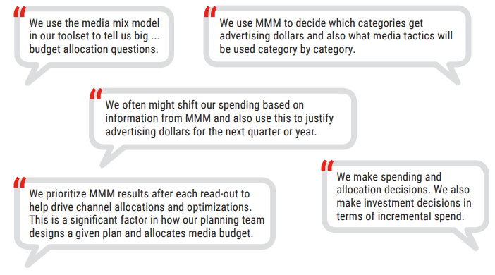

class: font150

# Learning Goals for this Lecture

- Define 'Media Mix Modelling' (MMM) and 'Media Mix Optimization' (MMO)
- Explain a Linear Regression Media Mix Model 
- Interpret Simple Media Mix Model outputs
- Identify feasible extensions to the Simple Media Mix Model and explain how it impacts the data needed for analysis
- Interpret output of Extended Media Mix Models 
- Explain the intuition behind Media Mix Optimization

---
class: inverse, center, middle

# Preliminaries

---
class: font160
# Where Are We Now? 

```{r, echo = FALSE, fig.align = "center", out.width="35%"}
url <- "https://png.pngtree.com/png-clipart/20211024/original/pngtree-pile-of-cartoonish-cute-doodle-theme-books-png-image_6871556.png"
knitr::include_graphics(url)
```

Course Themes:

1. **Measuring Advertising Effects**
  * `r icons:::icon_style(icons::fontawesome("check", style = "solid"), scale = 1)` Attribution Models
  * `r icons:::icon_style(icons::fontawesome("bullseye", style = "solid"), scale = 1)` Media Mix Modelling
2. User Generated Content & Social Media

---
class: font160
# Our learning journey... 

.center[.font120[Popular techniques for estimating the impact of advertising on sales]]

*Last Week*: Marketing Attribution Rules 

* Leveraging ability to track individual user data 

**This Week**: Media Mix Modelling 

* With aggregate data on advertising spend and sales

*Later*: Experimental Approaches

- Designing "experiments" in the field to accurately measure *incrementality*

---
# Wasteful Advertising Expenditures? 

```{r, echo = FALSE, fig.align = "center", out.width="100%"}
url <- "figs/wannamaker.png"
knitr::include_graphics(url)
```

.right[
Source: [Papergreat Blog](http://www.papergreat.com/2012/09/saturdays-postcard-wanamakers-and-1911.html)
]

---
class: font150
# Measuring Advertising Response

`r icons:::icon_style(icons::fontawesome("bullseye", style = "solid"), scale = 1)`
**The goal of any marketing campaign is to increase sales** 

* Either short-term or long-term

`r icons:::icon_style(icons::fontawesome("question", style = "solid"), scale = 1)`
**How to evaluate the performance of marketing?**

Each campaign / channel is evaluated on incremental profit that it produces relative to its cost 

$$
ROI = \frac{\text{incremental profit due to advertising} - \text{cost of advertising}}{\text{cost of advertising}}
$$


---
class: inverse, center, middle

# The What & Why of Media Mix Modelling

---
class: font160
# What is Media Mix Modelling?

According to [Marketing Evolution](https://www.marketingevolution.com/marketing-essentials/media-mix-modeling):

<br>
<br>

> An **analysis technique** that allows marketers to **measure the impact** of their **marketing and advertising campaigns** to determine how various elements contribute to their goal, which is often to drive conversions (sales)

<br>
<br>

.center[**That sounds a lot like Attribution Modelling :(**]

---
class: font160
# What is Media Mix Modelling?

A more workable definition:

> Aims to **measure the correlation between total sales/revenue** in each week/month **and advertising spending or impressions** on that same week/month

**Key Differences** to Attribution Modelling:

* Uses aggregate data
* Longer time horizon in the analysis (months vs weeks)
* Wider range of channels, both traditional and digital
* Incorporate external influences such as seasonality, promotions 
* Analysis done "less often"

---
class: font160
# The Business Problem

**Seeking Answers to the following Strategic Questions:**

1. How does a firm's marketing activities correlate to a KPI of interest? 
2. What is the optimal mix of marketing activities for a given KPI?

**Data Driven Approach**:

1. Media Mix Modelling (MMM)
  - Estimate how different marketing activities impact a KPI
  - How? Via Linear Regression .font80[(or some other statistical model)]
2. Media Mix Optimization (MMO)
  - Adjust budget allocation across marketing activities to optimize a KPI of interest

---
class: font160
# Why Media Mix Modelling?

```{r, echo=FALSE, out.width = '100%'}

```

.font70[Source: [IAB (2019)](https://www.iab.com/wp-content/uploads/2019/11/IAB_MMA_MTA-Guidebook_Nov-2019.pdf)]

---
class: font160
# CAUTION: Media Mix vs Marketing Mix

**Media Mix Modelling**:

* Seeks to understand the role each media type plays in driving the overall campaign performance. 

**Marketing Mix Modelling**:

* Take a more holistic view. 
* It doesn't just consider media channels but also factors in other marketing activities 
  * Pricing strategies, product distribution, and even macroeconomic indicators. 
* About viewing the larger picture and determining how these varying elements interplay to impact the overall marketing performance.

---
# Media Mix Modelling is NOT so new 

```{r, echo=FALSE, fig.align = "center", out.width = '60%'}
knitr::include_graphics("figs/when_adopt_mmm.png")
```

.font70[Source: [IAB (2019)](https://www.iab.com/wp-content/uploads/2019/11/IAB_MMA_MTA-Guidebook_Nov-2019.pdf)]

---
# Companies' familiarity with MMM

```{r, echo=FALSE, fig.align = "center", out.width = '60%'}

```

.font70[Source: [IAB (2019)](https://www.iab.com/wp-content/uploads/2019/11/IAB_MMA_MTA-Guidebook_Nov-2019.pdf)]


---
class: inverse, center, middle

# The Simple Media Mix Model

---
class: font160
# The MMM Problem 

Over-arching question: 

> **How does a firm's marketing activities impact revenue?** 

Split into answer two sub-questions:

(a) How does *each* marketing channel contribute to revenue?

(b) *What proportion of revenue can be attributed to marketing activities?*


.font70[
Notes: 

* We are using *revenue* as the KPI of interest 
* Others possible. Rarely used. Why?
]

---
class: font140
# MMM with Two Marketing Variables

Suppose company only spends on Facebook Ads and TV Ads, KPI is weekly revenue.

Then write a regression model:

\begin{equation}
\text{Revenue}_t = \beta_0 + \beta_1 \text{Facebook Ad Spending}_t + \beta_2 \text{TV Ad Spending}_t + \varepsilon_{t}
\end{equation}

We can say that:

* $\beta_0$ is the **baseline revenue** 
* $\beta_1 \text{Facebook Ad Spending}$ is the **additional revenue from Facebook Ad Spending**
* $\beta_2 \text{TV Ad Spending}$ is the **additional revenue from TV Ad Spending**
* $\beta_1 \text{Facebook Ad Spending} + \beta_2 \text{TV Ad Spending}$ is the **additional revenue from all marketing spending**

---
class: font120
# Interpreting the Simple Media Mix Model 

\begin{equation}
\text{Revenue}_t = \beta_0 + \beta_1 \text{Facebook Ad Spending}_t + \beta_2 \text{TV Ad Spending}_t + \varepsilon_{t}
\end{equation}

```{r, echo = FALSE, message = FALSE}
library(readr)
library(dplyr)
library(ggplot2)
library(broom)
media_mix <- read_csv("data/dt_simulated_weekly.csv")
options(scipen=999)

summary(lm(revenue/1e3 ~ I(facebook_S/1e3) + I(tv_S/1000), data = media_mix))
```

---
class: font140
# More Marketing Variables

Consider the Linear Regression with $m$ marketing activities:

\begin{equation}
\text{Revenue}_t = \beta_0 + \sum_{j=0}^{m} \beta_j X_{jt} + \varepsilon_{t}
\end{equation}

where: 

* $t$ is a unit of time (eg. week, month, etc)
* $Y_t$ is the KPI of interest (eg. Sales)
* $\beta_0$ is the regression intercept
* $X_{jt}$ is the marketing spend for the $j$th marketing variable (eg. TV ads, Facebook Ads, Google Search Ads, etc)
* $\beta_j$ is the incremental effect of one unit of $X_{jt}$
* $m$ is the number of marketing variables 
* $\varepsilon_t$ is the modelling error, i.e difference between predicted and actual values of the KPI


---
# More Marketing Variables: In Practice

```{r, echo = FALSE, message = FALSE}

summary(lm(revenue/1e3 ~ I(facebook_S/1e3) + I(tv_S/1000) + 
          I(search_S/1e3) + I(print_S/1e3), data = media_mix)
          )
```


---
class: inverse, center, middle

# Extending Media Mix Models I

---
class: font160
# Mixed Models 

**Extending the Strategic Vision**:

> *What if we believe the incremental impact of different marketing activities differs across regions?*

Goal:

- Estimate an impact that is true on average across all regions 
- Estimate deviations from this average that are region specific

$\implies$ We need data at the region level!

---
class: font140
# State Space Models 

**Extending the Strategic Vision**:

> *What if we believe the incremental impact of different marketing activities also differs across time?*

Goal:

- Estimate an impact that is true on average across all regions and time periods
- Estimate deviations from this average that are region and time specific

$\implies$ We need data on

* Revenue, and  
* Marketing Activities 

to vary across regions **and** over time!

---
# Comparing Alternative MMM Models

```{r, echo=FALSE, out.width = '100%'}
knitr::include_graphics("figs/contrasting_models.png")
```

.right[
.font70[
Source: [Accenture (2018)](https://www.accenture.com/_acnmedia/pdf-92/accenture-market-mix-optimization.pdf)
  ]
]


**Remark:** the effectiveness of advertising is varying across region or time 

$\implies$ the regression coefficients vary 

$\implies$ this is **not** controlling for regional differences or seasonality

---
class: inverse, center, middle

# Extending Media Mix Models II

---
class: font140
# Adding Control Variables

We can add extra variables to the model:

\begin{aligned}
\text{Revenue}_{it} = \beta_0 + \sum_{j=0}^{m} \beta_j X_{ijt} + \gamma Z_{ijt}  + \alpha_i + \tau_t + \varepsilon_{it}
\end{aligned}

where

* $Z_{ijt}$: other variables that influence revenue .font70[(and correlate with $X_{ijt}$)]

<br>

* $\alpha_i$: differences in level of revenue across region .font70[(that are constant over time)]

<br>

* $\tau_t$: seasonality $\rightarrow$ differences in level of sales across time  .font70[(that are the same for all regions)]

---
class: font140
# Adding Control Variables

We can add extra variables to the model:

\begin{aligned}
\text{Revenue}_{it} = \beta_0 + \sum_{j=0}^{m} \beta_j X_{ijt} + \gamma Z_{ijt}  + \alpha_i + \tau_t + \varepsilon_{it}
\end{aligned}

Why might we do this?

* Omitted Variable Bias 

<br>

* Better predictive ability

---
class: font160
# More Complex Effects of Advertising

So far assumed:

- "*Spending yesterday doesn't impact revenue today*"
  - Advertising spending in time period $t$ only impacts KPI in $t$


<br>

- "*Every dollar spent per channel is equally effective*"
  - Marketing activities do not have a non-linear effects on sales

<br>

.center[**These are strong assumptions!**]

---
# Temporal Effects of Advertising 

```{r, echo = FALSE, fig.align = "center", out.width="60%"}
url <- "figs/time_effects.png"
knitr::include_graphics(url)
```

.right[
.font70[
Source: [Pandey et. al. (2021)](https://www.ijert.org/research/marketing-mix-modeling-mmm-concepts-and-model-interpretation-IJERTV10IS060396.pdf)
  ]
]


---
# Non-Linear Responses to Advertising

```{r, echo = FALSE, fig.align = "center", out.width="75%"}
url <- "figs/non_linear_effects.png"
knitr::include_graphics(url)
```

.right[
.font70[
Source: [Pandey et. al. (2021)](https://www.ijert.org/research/marketing-mix-modeling-mmm-concepts-and-model-interpretation-IJERTV10IS060396.pdf)
  ]
]


---
class: inverse, center, middle

# Media Mix Optimization

---
class: font160
# Media Mix Optimization Problem 

> **How to allocate a marketing budget over multiple channels?**

* Assume there is one KPI we want to maximize (eg. Revenue):

* We can *predict* revenue based on a media mix model 

* We have a fixed budget to allocate 

Simplification for today:

* We assume we want to maximize sales *this time period* only 
* By allocating spending across channels in this time period only
* Remark: Can be extended to set optimal strategy for multiple periods

---
class: font160
# Media Mix Optimization Problem

Think of **Media Mix Optimization** as a two step process

- Simulate different budget allocations and their impact on a KPI, 
- Choose the best allocation
- Assumes the media mix model that predicts revenue already exists

This is a constrained optimization problem

- How to do this is beyond the scope of this class...
- ... But the intuition is not

---
class: font160
# Media Mix Optimization 

The Media Mix Optimization problem:

\begin{align}
\max \quad &\text{Predicted Revenue}_t \\
     &\text{subject to} \quad \text{Total Expenditure}_t \leq \text{Budget}_t
\end{align}


---
class: font140
# Media Mix Optimization Example

Using our two marketing activity example:

\begin{align}
\max \quad &\hat{\text{Revenue}_t} \\
     &\text{subject to} \quad \text{Facebook Ad Spending}_t + \text{TV Ad Spending}_t \leq \text{Budget}_t
\end{align}

<br>

Equivalently:

\begin{align}
\max \quad &\underbrace{\hat{\beta}_0 + \hat{\beta}_1 \text{Facebook Ad Spending}_t + \hat{\beta_2} \text{TV Ad Spending}_t}_{\text{MMM Model}} \\
     &\text{subject to} \quad \text{Facebook Ad Spending}_t + \text{TV Ad Spending}_t \leq \text{Budget}_t
\end{align}

<br>

.center[**This can be solved on a computer!**]

---
class: inverse, center, middle

# Recap

---
class: font160
# Media Mix vs Attribution Models

**Attribution Modelling:** 

* Bottom up 
* Individual user data 
* Digital advertising only
* High frequency planning

**Media Mix Modelling:**

* Top down 
* Time Series data 
* Can account for offline variables
* Low frequency planning and optimization


---
class: font140
# Deeper Reflections on MMM

**It's hard to think of Media Mix Models in causal terms** 

* Omitted / Lurking Variables 
* Marketing Spending is **not** randomly allocated

$\implies$ careful when interpreting outputs 

As a 'prediction' model this is OK ...

* And how I think about MMM, "can I predict sales with marketing activities"

But then, **the coefficients don't have causal interpretations**, so does MMO make sense?

$\implies$ it's a tricky space 

* Some recent developments trying to wrestle with this ... beyond our scope

---
class: font160
# Summary 

* Media Mix Modelling (MMM) relates a KPI (revenue) to marketing activities over time 

* MMM can allow for effects of marketing to differ across regions and over time 

* Simplified MMM models can be extended to allow for non-linear effects that offer more 'realistic' assumptions on how marketing impacts a KPI

* Media Mix Optimization solves for optimal marketing budget allocation given the estimates from a MMM problem

---
# License & Citation

Suggested Citation:

```{r, engine='out', eval = FALSE}
@misc{deerdsms2024,
      title={"Digital and Social Media Strategies: Media Mix Modelling"},
      author={Lachlan Deer},
      year={2024},
      url = "https://github.com/deer-marketing-lab/dsms-lecture-mediamix"
}
```

<p style="text-align:center;"></p>

This course adheres to the principles of the Open Science Community of Tilburg University. 
This initiative advocates for transparency and accessibility in research and teaching to all levels of society and thus creating more accountability and impact.

<p style="text-align:center;"></p>
This work is licensed under a <a rel="license" href="http://creativecommons.org/licenses/by-sa/4.0/">Creative Commons Attribution-ShareAlike 4.0 International License</a>.